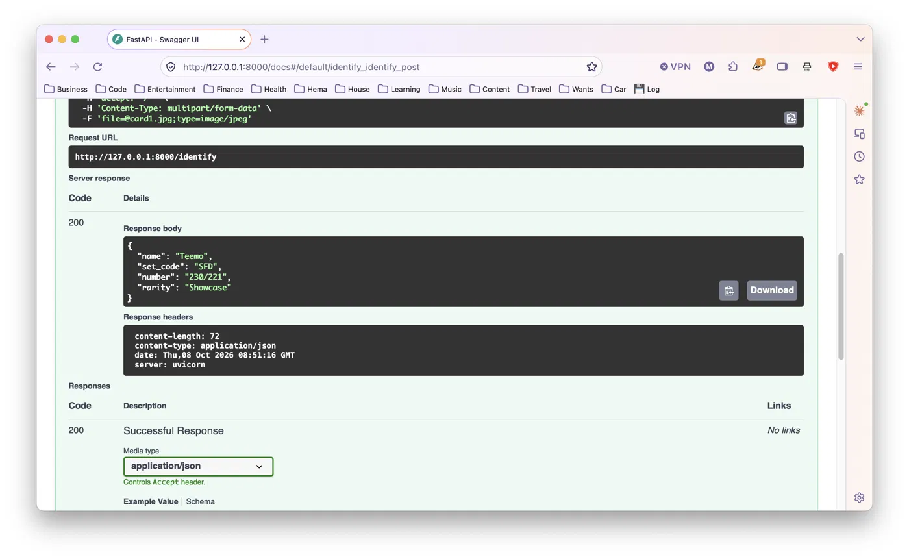

**Card Scout**

An AI agent that identifies Riftbound trading cards from photos built to support my Riftbound TCG trading/collecting (in progress).

To run it:

```bash
python3 -m venv venv
source venv/bin/activate
pip install -r requirements.txt
uvicorn main:app --reload
```

Then open http://127.0.0.1:8000/health

Next:

- Identify a card from a photo


- Look up prices from legitimate APIs
- Measure identification accuracy on photos of my own cards